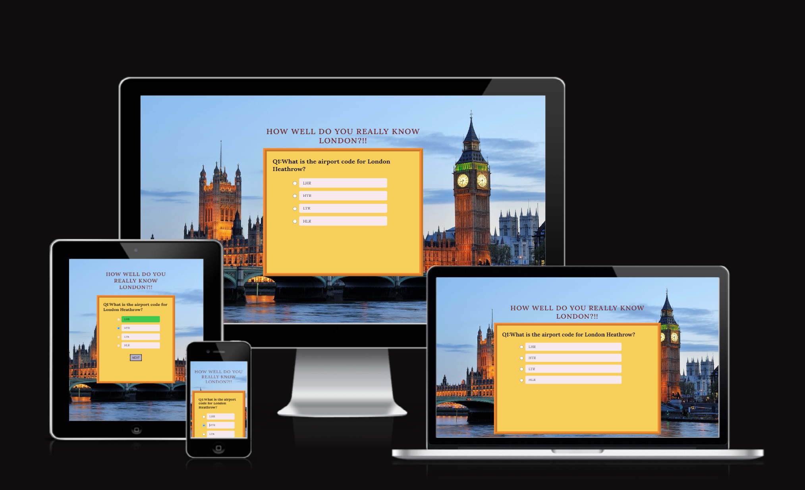
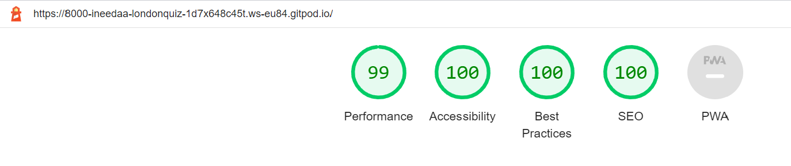

# London Quiz

London Quiz is a website that mainly aims with testing the knowledge of how well users really know about London and its history.

## User Stories

- As a visiting user,I am aware that this website test the knowledge of the user about London and its history.
- There are total 10 questions that needs to be answered.
- After clicking among the four options of answer provided,user can click the submit button.
- By clicking on the submit button,the user gets to know whether the answer is right or wrong and the updated score .
- By finishing the ten questions ,the user gets the final score of the game.

## Features

### Existing Features

   

#### Header
- The header in the page displays the topic of the quiz and what the quiz actually relates to.

#### Quiz Container
- The quiz container contains the set of one question and four options.
- Each quiz question is displayed one at a time and a set of options are presented below for the user to pick an answer. Each answer option consists of a radio button.
- when user clicks the submit button ,immediately the score and the next button pops up.
- The next button takes the user to the next set of questions.

#### Score Area
- The hidden score area pops up when user clicks the submit button.
- The question count, counts the questions out of 10. This is useful for the user to know which question they are on and how many are left.
- In the score area the user gets informed whether the answer is true or false and the updated total score out of ten questions.

#### Final Page
- when user finally finishes the ten questions ,the user is taken to a final page which has total score of the quiz game.

## Features Left to Implement

- In future,this website may add more features such as a timer,to add a background music when the user wins or loses and a previous button, when user wants to go back to the previous question.  

## Typography and Color scheme

- The font used in this website is  'Lora' from 'serif' font family [Google fonts](https://fonts.google.com).
- The background color for the main page is #f3dcdc.For the 'next' and 'submit' buttons, when the mouse hover over it,changes the background color.
- The score area has more dark contrast of the background color which highlights the score.

## Technology
The technology used in this website is :
  - **HTML**  for loading the text content.
  - **CSS**  for creating a User Interface.
  - **JavaScript** for logic behind the quiz game.
  - **Gitpod**  as a workspace.
  - **GitHub**  for deployment of the webpage.

## Libraries & Frameworks

* [Google Fonts](https://fonts.google.com/)
* [Font Awesome](https://fontawesome.com/)

## Tools

* [Am I Responsive](https://ui.dev/amiresponsive)
* [Balsamiq](https://balsamiq.com/wireframes/)
* [Chrome Developer Tools and Lighthouse](https://developer.chrome.com/docs/devtools/)
* [GitPod](https://www.gitpod.io/)
* [GitHub](https://github.com/)
* [JSHint A Static Code Analysis Tool for JavaScript](https://jshint.com/)
* [W3C Markup Validation Service](https://validator.w3.org/)
* [W3C CSS Validation Service](https://jigsaw.w3.org/css-validator/)

## Testing

### Quiz Page
 - When user opens the website the user receives the home page.
   
   
   
 -  User can use pointer to click the radio button and click the submit button.A hidden score area pops up and shows the answer is correct.Also shows the next button to go to the next page.
    
    

 - Also user gets an incorrect answer message if the answer is incorrect.
   
   
 
 - While finishing the ten questions ,the user gets the final result.if the ten answers are right the user gets this message.
   
   
 - If the one of the answers is wrong,the user gets this message.
    
    
 
### Validator Testing
 - #### HTML
   - No errors found whie testing on [W3Cvalidator.](https://validator.w3.org/)
 - #### CSS
   - No errors found while testing on [W3Cvalidator.](https://validator.w3.org/)
 - #### Lighthouse
   
   - 
 
 - #### JavaScript
   - No errors found while testing on [JSHint](https://jshint.com/)
   - The following metrics were returned.
     - There are 10 functions in this file.
     - Function with the largest signature take 1 arguments, while the median is 0.
     - Largest function has 12 statements in it, while the median is 2.5.
     - The most complex function has a cyclomatic complexity value of 4 while the median is 1.
### Fixed Bugs
   - Fixed bugs that caused increase in number of questionindex while pressing the next button.Solved by creating a displayNextQuestion function with the help of my mentor Rohit Sharma.
   - Solved a bug that removes the hide feature of 'next' button with the help of tutors of Code Institute.
### Supported Browsers
  - Compatible to Google Chrome.
  - Used chrome stimulator for testing mobile screens.Compatible to all the stimulators in chrome bowser developer tools.

## Deployment

### GitHub Pages
- The site was deployed to GitHub pages. The steps to deploy are as follows:
- In the GitHub repository, navigate to the Settings tab
- From the source section drop-down menu, select the Master Branch
- Once the master branch has been selected, the page will be automatically refreshed with a detailed ribbon display to indicate the successful deployment.
- The live link can be found [here.]( https://ineedaa.github.io/London-Quiz/)

### Gitpod 
- In GitHub repository,click on the Gitpod icon on the right hand side .
- Wait for the page to load in browser.
- In terminal,write 'python -m http.server' command.
- Click the browser button in the port 8000 that pops up.
- The page will automatically deployed in the browser.

## Credits

- Content
  - The inspiration for creating the website and content  was taken from [The Ultimate London Quiz.](https://www.londonxlondon.com/london-quiz/).
  - The forEach function is implemented from [w3schools.](https://w3schools.com)
  - The most of the logic and codes in the JavaScript are adopted from [Thapa Technical.](https://www.youtube.com/watch?v=rGhH70KUTuk).
  - Most of the logic used in this project are inspired from Love Maths Running Project.
- Media
  - The photo used on this site are from [Google Images](https://www.google.com)
 
